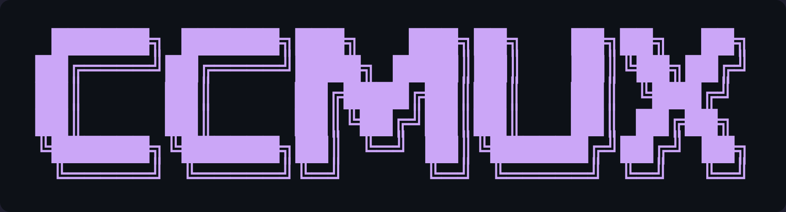
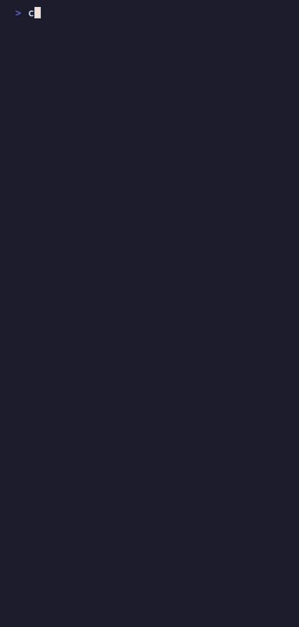
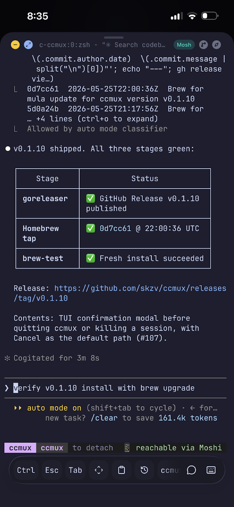

<div align="center">



_Terminal session manager for AI coding agents._

**Run your coding agents from any device — even your phone.**

ccmux is one TUI for every coding-agent session you've got running — Claude Code, Codex, Cursor, and more. Start, resume, and supervise them all from your Mac, your laptop, or your phone. No tmux session names to memorize, no `claude --resume <hash>` to type, no SSH-then-attach gymnastics. It runs over your tailnet and attaches over SSH or Mosh. Setup is one command.

[](https://github.com/skzv/ccmux/actions/workflows/ci.yml)
[](https://go.dev/)
[](LICENSE)
[](#status)
[](https://charm.sh/)


</div>

## 🚀 Install

```bash
brew install skzv/tap/ccmux
ccmux setup
```

Homebrew is recommended on macOS; Linuxbrew works on Linux. `ccmux setup` finishes first-run setup for Tailscale, agent CLIs, and the background daemon.

Other paths:

- No Homebrew: `curl -fsSL https://raw.githubusercontent.com/skzv/ccmux/main/scripts/install.sh | sh`, then `ccmux setup`.
- From source: `git clone https://github.com/skzv/ccmux.git && cd ccmux && make setup`.

Works on macOS, Linux, and Windows via WSL2. Source builds require Go 1.26+.

---

## The loop

It's 11pm. The session you started this morning on your Mac is still running — your laptop's lid has been closed for hours, but the daemon held a `caffeinate` lock and Claude kept thinking.

Your phone vibrates: Claude is asking a question. You tap the notification, you're attached. You answer, hit `Ctrl-b d`, lock the phone.

Tomorrow morning on the train, you open your laptop, type `ccmux` — the same session is right there, exactly where you left it. **Three device transitions. Zero CLI commands.**

That's ccmux. The same session, the same TUI, on every device. No host config, no session-name memory, no `claude --resume`. Just press `Enter` on the row you want.

---

## 🎛️ One view. Every session, every project, every device.

<div align="center">

</div>

Color-coded by state — **active**, **idle**, **needs your input**. The Devices panel shows every other ccmux-running machine on your tailnet right next to it. The usage panel tallies Claude's 5-hour quota and per-agent prompt counts. Live updates as each session moves through states.

---

## 🔁 Same session. No commands in between.

The "start on Mac, continue on phone" loop, end to end:

<div align="center">


<em>your Mac — attach with <code>Enter</code>, detach with <code>Ctrl-b d</code></em>

<br/><br/>



<em>your phone — same TUI, narrower (Blink, Termius, or the Moshi app)</em>

</div>

tmux is the session store; ccmux is the lens. The phone-width layout collapses everything into a single scrollable column when ccmux runs in a narrow terminal. Mosh makes the connection survive cell→wifi roaming, lid-close, walking-out-of-range — so you can detach the phone on the train and reattach two stops later.

---

## 🆕 Spawn from any device.

<div align="center">

</div>

Open the Projects tab, press `n`. Pick which device should host the new project — local, or any reachable peer running `ccmuxd` on your tailnet. The remote daemon creates the directory natively and starts the agent. ccmux SSH-attaches you in. You never typed `ssh`, never typed `mkdir`, never typed `tmux new-session`.

The new-project form also picks the agent (Claude, Codex, Cursor, and more) for this project — the choice sticks at `<project>/.ccmux/agent`.

---

## 💬 Every conversation. One tap.

<div align="center">

</div>

ccmux remembers every past Claude / Codex / Antigravity thread, sorted by recency. Press `2` for the Conversations screen, navigate, press `Enter`. The daemon resumes the agent with the correct session ID. You don't type `claude --resume <hash>` ever again.

Headless agent runs (`claude -p`, `codex exec`, SDK invocations) are filtered out by default so a scripted workflow doesn't drown the list — press `H` to toggle them back on.

---

## 🤖 Every agent. One workflow.

<div align="center">

</div>

Pick per project which AI runs it — ccmux works with [Claude Code](https://claude.ai/code), [Codex](https://github.com/openai/codex), [Antigravity CLI](https://antigravity.google/download), [Cursor](https://cursor.com/cli), [pi](https://pi.dev), [Grok](https://x.ai/cli), and more, speaking each one's launch and resume dialect. The choice is sticky, stored at `<project>/.ccmux/agent`. The dashboard, daemon state-detection, and dispatch all follow per-project. Press `a` in the Projects tab to switch the selected project's agent (cycles claude → codex → antigravity → cursor → pi → grok).

Dashboard rows on non-default agents get a small `[codex]`, `[antigravity]`, `[cursor]`, `[pi]`, or `[grok]` tag so a single glance tells you what's running where.

---

## 📝 Project notes, terminal-native.

<div align="center">

</div>

Per-project Notes tab — every `.md` file in the project, organized as a collapsible folder tree, with markdown rendered inline by [Glamour](https://github.com/charmbracelet/glamour). Folders open **collapsed** so a deep notes tree doesn't bury you: `→`/`l` expands a folder (or drills in), `←`/`h` collapses it (or jumps out to the parent). Want it all open? Launch with `ccmux --expand-notes` or set `[notes] expand_folders = true`. Ripgrep-backed `/` search. Plain markdown on disk is the source of truth. No sync service. No cloud. Press `e` to edit a note in `$EDITOR`; ccmux reads notes, writing them is the agent's job.

Notes follow you across devices: press `H` to toggle which machine you're viewing notes from — the local box or any reachable ccmuxd peer on your tailnet. The list, preview, and search all re-scope to the selected device (read-only for remote). Scriptable too: `ccmux notes list|read|search <project> [--host <name>]`.

---

## 🩺 Manage your agents.

<div align="center">

</div>

One screen for "is my agent installed and signed in?" Per-agent CLI version, config root, login status, and a command palette to re-run setup or open the config directory.

---

## ⚙️ Setup is a flow, not a README.

<div align="center">

</div>

`ccmux setup` is the interactive wizard. It checks `tmux` / `mosh` / `tailscale` / `claude` / `gh` and offers to `brew install` whatever's missing. The first time you launch `ccmux` on an unconfigured machine it offers to run setup for you (decline once and it won't ask again). For dotfiles / provisioning, `ccmux setup --yes` runs non-interactively — it takes the recommended answer at every prompt (install deps, generate the SSH key, install the daemon autostart) and skips the integrations that can't be scripted (Moshi pairing, Tailscale/`gh` browser auth). `ccmux doctor` is the non-interactive health check — perfect for scripting or when something stops working.

---

## 🔄 Updates are in-place.

<div align="center">

</div>

Dashboard shows a banner when a new release lands. `ccmux update` git-pulls the checkout, rebuilds, reloads `ccmuxd`. Flags: `--dry-run`, `--skip-pull`, `--no-restart`. The Devices panel tags any tailnet peer running a behind-version of ccmuxd so you see at a glance which machines need an update.

---

## 📱 Mobile setup

The way to use ccmux on your phone today is the **[Moshi](https://getmoshi.app/) app**. Moshi holds a Mosh connection to your Mac alive through roaming and lid-close, raises a real push notification when an agent needs you, and shows a live picker of your sessions — tap one and you're attached to ccmux's TUI on your phone.

<div align="center">

<br/>
<em>ccmux in the Moshi app — a live session on your phone, attached over Mosh</em>
</div>

```bash
ccmux moshi-setup
```

Installs [moshi-hook](https://getmoshi.app/) on the Mac, runs **Easy Pair** (a QR code appears in your terminal — scan it with the Moshi iOS app, done), and wires the Claude Code hooks that turn `needs_input` events into **categorized** push notifications (approval_required vs task_complete). Tap the notification, the Moshi app shows your live tmux session list, pick one, attach, answer, detach. No tokens to copy.

Plain BEL fallback works in any iOS terminal client (Blink Shell, Termius) — you lose the categories, that's it. For headless / scripted setups: `ccmux moshi-setup --token <token>` bypasses the QR flow.

**Native apps:** dedicated iOS and Android apps that talk to `ccmuxd` directly over your tailnet are in active development.

---

## 🛰️ Multi-machine (auto-discovered)

```bash
# On the always-on Mac Mini:
ccmux daemon install                       # ccmuxd survives reboot
# edit ~/.config/ccmux/config.toml: listen_tailnet = true

# On the laptop — nothing to do:
ccmux                                      # dashboard already lists the Mini
```

Every refresh, ccmux runs `tailscale status --json`, probes each online non-mobile peer for a `ccmuxd /v1/health`, and merges the responders into the host list. Install ccmux on a new device, start its daemon, and it shows up on every other device on your tailnet within seconds.

The Devices panel on the Dashboard shows every device on your tailnet:

- 🟢 **peers running ccmuxd** — with their reported version + an "update available" tag whenever they lag this build
- ⚪ **peers NOT running ccmuxd** (Macs/Linux boxes you haven't installed on yet) — with a one-line "ccmux not installed" hint
- 📱 **phones / iPads** — with a "connect via Moshi app" hint (the iOS Moshi app is their picker; they don't run ccmux directly)

Attaching to an auto-discovered peer execs `ssh -t <host> -- tmux attach -t <name>` (cross-platform PATH prepend so Homebrew/Snap/Linuxbrew tmux is found). If you've pinned a host with `ccmux host add --mosh <name> …`, ccmux uses `mosh` instead — tolerates roaming and stalls.

> Manually pinning a host with `ccmux host add` still works — useful for non-Tailscale hosts, or to force a specific port. Discovered hosts and pinned hosts coexist on the dashboard without duplicates.

---

## ⚙️ Config

`~/.config/ccmux/config.toml` — the knobs that matter:

```toml
[projects]
root = "~/Projects"                  # where ccmux looks for projects

[daemon]
poll_interval_seconds = 2
idle_seconds_for_needs_input = 3
listen_tailnet = false               # set true on your server-mode host
tailnet_port = 7474

[sleep]
mode = "safe"                        # "safe" | "dangerous" | "very_dangerous"
idle_release_minutes = 10
low_battery_cutoff = 20              # dangerous mode auto-downgrades below this

[notifications]
bell = true                          # ring local terminal BEL on needs_input
```

> **Notifications:** the bell always rings on `needs_input` transitions when `bell = true`, regardless of whether moshi-hook is paired. The audible chime at your desk and the push on your phone are complementary, not duplicates. Set `bell = false` if you'd rather rely on phone pushes alone.

> **Sleep-mode notes:**
>
> - `safe` — `caffeinate -s` on macOS (Apple's policy keeps it AC-only). `systemd-inhibit --what=sleep:idle` on Linux.
> - `dangerous` — `caffeinate -d -i -m -s` on macOS, works on battery too. Daemon polls battery once a minute and downgrades to `safe` when below `low_battery_cutoff` (so a forgotten laptop doesn't run flat).
> - `very_dangerous` — adds `sudo -n pmset -a disablesleep 1` (macOS) / `sudo -n systemctl mask sleep.target …` (Linux). Requires passwordless sudo for the specific command; silently degrades to `dangerous` if sudo prompts. Always reverted when ccmuxd exits cleanly.
>
> Example sudoers entry (run `sudo visudo -f /etc/sudoers.d/ccmux`):
>
> ```
> # macOS
> %admin ALL=(ALL) NOPASSWD: /usr/bin/pmset -a disablesleep *
> # Linux
> %sudo ALL=(ALL) NOPASSWD: /bin/systemctl mask *, /bin/systemctl unmask *
> ```

`projects.root` and `subscription.tier` are also editable inline from the Settings screen — `↑/↓` to move, `Enter` to edit, `e` to open `$EDITOR` for the prose-heavy fields. After editing, run `ccmux update` to reload the daemon with the new config.

---

## ✨ Full feature list

<details>
<summary>Click to expand</summary>

### 🎛️ Session management

- Live dashboard of every agent session across every project, with state (active / idle / **needs_input**) and per-row agent tags
- One-key attach, kill, rename — applies a styled tmux status bar so you always know where you are
- Per-session "keep awake" pin — the daemon holds a sleep-prevention lock while any pinned or active session is alive
- **Three sleep-prevention modes** — `safe`, `dangerous`, `very_dangerous` (sudo-gated; system-wide override that survives lid-close)

### 🏗️ New projects

- `ccmux new <name>` — creates the directory + starts the agent. **No CLAUDE.md, no docs/ tree, no git init.** Bootstrapping is the agent's job.
- **Open a project = see its history.** Enter on a project lists running sessions _and_ past conversations.
- **Conversations list hides automation noise.** Headless `claude -p` / SDK runs and `codex exec` invocations are filtered by default. Press `H` to toggle. Antigravity transcripts carry no headless tag, so those are always shown.
- **Create on any device.** Press `n` in Projects, pick a host, the remote daemon does the work.
- **Every subdirectory of your projects root shows up** — no marker file required. `git · CLAUDE · docs/` tags tell you which dirs are real software projects vs scratch dirs.

### 🤝 Multi-agent

- Per-project agent stored in `<project>/.ccmux/agent` — sticky across sessions
- New-project form cycles Claude / Codex / Antigravity / Cursor / pi / Grok with `←/→`
- Press `a` in Projects to switch the selected project's agent
- Dashboard rows on non-default agents get a small `[codex]`, `[antigravity]`, `[cursor]`, `[pi]`, or `[grok]` tag
- Daemon state-detection (active / idle / needs_input) dispatches per agent for correct heuristics
- `ccmux doctor` enumerates installed agents; setup wizard points at the right install command for each
- Moshi push integration is currently Claude-only — Codex / Antigravity sessions get the audible terminal bell (still triggers a generic iOS push). Phase-2 work tracked in [`docs/01_Specs/02_Multi_Agent.md`](docs/01_Specs/02_Multi_Agent.md)

### 🤖 Claude Code config management

- Dedicated "Claude" screen for everything in `~/.claude/`
- Model picker (Opus 4.7 / Sonnet 4.6 / Haiku 4.5 / opusplan / custom) — global or per-project
- Reasoning-effort picker (`low` / `medium` / `high` / `xhigh` / `max`) + `alwaysThinkingEnabled` toggle. Writes `effortLevel` to `~/.claude/settings.json` so every new Claude Code session inherits your default.
- Browse + create slash-command aliases, manage MCP servers, hooks, permission allowlists
- View & edit global and per-project `CLAUDE.md` from the TUI

### 📝 Notes, terminal-native

- Per-project Notes tab — every `.md` file in the project, as a collapsible folder tree, rendered by Glamour
- Folders open collapsed; `→`/`←` (or `l`/`h`) expand/collapse them — or open everything with `ccmux --expand-notes`
- Ripgrep-backed `/` search; plain markdown on disk is the source of truth (no required cloud)
- Browse, preview, edit-in-`$EDITOR` — ccmux reads your notes; writing them is the agent's job
- Cross-device: `H` toggles which device's notes you're viewing (local or any tailnet peer); also via `ccmux notes list|read|search --host <name>`

### 📲 Mobile workflow (Moshi / iOS / Android)

- **Easy Pair via QR code** — `ccmux moshi-setup`; scan the QR code with the Moshi app, you're paired. No token paste.
- **Categorized push notifications** via `moshi-hook` plugging into Claude Code's hooks system (approval_required, task_complete)
- **In-app session picker** — the Moshi app lists every tmux session on the paired host
- **Auto-detection** — ccmuxd suppresses its BEL trigger when moshi-hook is paired so you don't get duplicate notifications

### 🌐 Local & remote modes

- **Local** — manages tmux sessions on this machine; prevents sleep while sessions are active
- **Server** — daemon binds an HTTP API to your Tailscale interface for remote ccmux clients
- **Mixed** — dashboard shows local + remote sessions, color-coded by origin

### 🩺 Setup, doctor, update

- `ccmux setup` — interactive wizard, checks every dep, offers `brew install` for missing pieces; `--yes` runs it non-interactively for scripts, and the first launch on a fresh machine offers to run it for you
- `ccmux doctor` — non-interactive health check (great for scripting)
- `ccmux update` — pulls the git checkout, rebuilds, reloads ccmuxd
- `ccmux uninstall` — clean removal, never touches your projects or `~/.claude/`

### 🎨 Quality of life

- Catppuccin Mocha by default; Dracula / Nord / Gruvbox / Tokyo Night planned
- `?` opens contextual key help on every screen
- Vim-style (`h/j/k/l`) and arrow keys both work
- Auto-switches to a curated narrow-terminal layout under 120 cols (phone mode) — reference detail is dropped so the essentials fit a phone screen
- Mouse support on by default (hold **Option (⌥)** while dragging to bypass tmux mouse reporting in iTerm2 / Terminal.app)
- **Cross-device clipboard via OSC 52** — selecting text inside a remote tmux pane lands on your _local_ clipboard. Works in iTerm2, Ghostty, WezTerm, Alacritty, kitty. Terminal.app does NOT support OSC 52 writes. `ccmux doctor` tells you exactly which side is missing.
- **No telemetry. Ever.**

</details>

---

## 📚 Tutorials

Six hands-on walkthroughs. Each is self-contained — pick whichever maps to what you're trying to do.

### 1. Your first project, end-to-end (≈3 min)

The core loop: create → talk to your agent → take notes.

```bash
ccmux new auth-redesign            # or: ccmux new auth-redesign --agent codex
```

That command does two things, and **only** two things:

1. Creates `~/Projects/auth-redesign/` — an empty directory.
2. Opens a tmux session named `c-auth-redesign` and starts your agent inside it (Claude by default).

ccmux does **not** scaffold the project — no `CLAUDE.md`, no `docs/` tree, no `git init`, no GitHub repo. Bootstrapping is the agent's job, done inside the session: run `/init` to have the agent write `CLAUDE.md`, `openspec` to set up specs, `git init` whenever you want version control. ccmux opens the door; what the project becomes is up to you and your agent.

To check on the session without joining the conversation: `ccmux list`. To attach: `ccmux attach auth-redesign`. The session keeps running after you detach.

### 2. Juggling multiple agent sessions (≈2 min)

```bash
ccmux
```

The Dashboard shows all sessions, color-coded by state:

- **active** — the agent is generating output right now.
- **idle** — finished, no prompt visible.
- **needs_input** — the agent's input box is up and the pane has been quiet for ≥ 3 seconds. **This is the one to watch.**

When a session transitions to `needs_input`, ccmuxd injects a terminal BEL. Any iOS terminal client that maps BEL→notification raises a push.

Useful keys on the Sessions screen:

- `Enter` — attach
- `x` — kill the highlighted session
- `R` — rename
- `?` — full keymap

### 3. Working from your phone (≈3 min, one-time setup)

See the [Mobile setup](#-mobile-setup) section above.

### 4. Configure ccmux (≈2 min)

See the [Config](#%EF%B8%8F-config) section above. `~/.config/ccmux/config.toml` has the full set of knobs.

### 5. Multi-machine: laptop + always-on Mac Mini (≈5 min)

See the [Multi-machine](#-multi-machine-auto-discovered) section above. Heavy users live in this flow: sessions on the Mini, clients on laptop/phone, no host config — auto-discovery handles it.

### 6. Maintenance (≈1 min)

```bash
ccmux doctor          # one-shot health check
ccmux update          # git pull + rebuild + reinstall + restart daemon
ccmux uninstall       # clean removal
```

`ccmux update` auto-detects your git checkout (defaults to `~/Projects/ccmux`). Flags: `--dry-run`, `--skip-pull`, `--no-restart`.

---

## Uninstall

```bash
ccmux uninstall            # interactive: shows what it'll do, asks y/N
ccmux uninstall --yes      # skip the prompt
ccmux uninstall --dry-run  # preview only
```

What gets removed:

- Running `ccmuxd` (SIGTERM)
- `~/.local/bin/ccmux` and `~/.local/bin/ccmuxd`
- `~/.local/state/ccmux/` (socket, logs)
- `~/.local/share/ccmux/` (snapshots, daemon db)
- `~/.config/ccmux/` (unless `--keep-config`)
- The ccmux-styled tmux status bar on every `c-*` session (unless `--keep-chrome`)

What is **never** touched:

- Your project directories
- Notes under `<project>/docs/`
- `~/.claude/` (Claude Code state + moshi-hook entries)

To also remove `moshi-hook`: `brew services stop moshi-hook && brew uninstall moshi-hook && brew untap rjyo/moshi`.

---

## 🏛️ Architecture

```
        LAPTOP (client + local)                MINI (local + server)
   ┌─────────────────────────────┐         ┌──────────────────────────────┐
   │  ccmux TUI                  │ ──http──►  ccmuxd HTTP                 │
   │   ├─ local sessions ◄─unix──┤ tailnet │   ├─ sessions (mini-foo)     │
   │   │   • laptop-bar          │ ────────►   │   • mini-foo (active)    │
   │   │   • laptop-baz          │         │   │   • mini-cas (waiting 🔔)│
   │   └─ remote: mini           │         │   └─ caffeinate -s while active
   │      • mini-foo             │         │                              │
   │                             │         │ ccmuxd Unix socket           │
   │                             │         │  (for local TUI on mini)     │
   └─────────────────────────────┘         └──────────────────────────────┘
                                                       ▲
                                                       │ Mosh
                                                       │ (when phone connects)
                                              ┌────────┴──────────┐
                                              │  iPhone (Moshi /  │
                                              │  Blink / Termius) │
                                              └───────────────────┘
```

Full design: [`docs/02_Architecture/00_System_Design.md`](docs/02_Architecture/00_System_Design.md).
TUI design system: [`docs/02_Architecture/04_TUI_Design_System.md`](docs/02_Architecture/04_TUI_Design_System.md).

---

## 🗺️ Roadmap

Phasing in [`ROADMAP.md`](ROADMAP.md). Headline:

- **v0.1** — TUI, sessions, notes, setup wizard, daemon, local + server + mixed modes, terminal-bell notifications, Homebrew tap
- **v0.2** — Snapshots, themes, command palette, tailnet web viewer for notes, cost tracking from Claude transcripts
- **v0.3** — Multi-select session ops, activity heatmap, daily-journal rollups, mDNS host discovery
- **Long term** — Native SwiftUI iOS app talking directly to ccmuxd over Tailscale

Infrastructure follow-ups tracked in [`docs/01_Specs/03_Testing_And_CI.md`](docs/01_Specs/03_Testing_And_CI.md):

- 🔁 **CI integration** — GitHub Actions matrix (test + cross-compile + integration) so PRs can't merge with regressions
- 💪 **Stress testing** — `cmd/ccmux-stress/` harness for 20+ session loads, notification storms, 24h long-haul, with pprof + FD-leak detection
- 🐛 **Terminal crawling** — `cmd/ccmux-crawl/` monkey-tester + native fuzzers + `rapid` property tests to find the bugs no human would think to try

---

## Design principles

1. **Terminal-first, not terminal-only.** Must work in a Mosh pane on an iPhone.
2. **One source of truth: tmux.** ccmux is a view; tmux is the database.
3. **Plain markdown on disk** beats vendor lock-in. No required cloud, no required sync.
4. **Notifications by terminal bell.** Reuses what every iOS terminal client already supports.
5. **Setup is a flow, not a README.** First-run wizard installs what it can, instructs for what it can't.
6. **No telemetry. Ever.**

---

## Status

**Alpha.** Core flows (attach, new, kill, notes, daemon, Moshi) work end-to-end. Expect rough edges; file issues. Wait for v0.1 if you want it for real work.

---

## Built with

Standing on the shoulders of [Charm](https://charm.sh/):

- [Bubble Tea](https://github.com/charmbracelet/bubbletea) — the TUI framework
- [Lipgloss](https://github.com/charmbracelet/lipgloss) — styling
- [Bubbles](https://github.com/charmbracelet/bubbles) — list, viewport, textinput, spinner, help
- [Huh](https://github.com/charmbracelet/huh) — forms for the setup wizard
- [Glamour](https://github.com/charmbracelet/glamour) — markdown rendering

Plus [Cobra](https://cobra.dev/) for the CLI surface and [SQLite](https://gitlab.com/cznic/sqlite) for daemon state.

---

## Contributing

Issues and PRs welcome. See `CONTRIBUTING.md` (TBD). The short version:

- Code style: `gofmt`, `go vet`, `staticcheck`
- Tests: `make test` (unit) and `make test-e2e` (integration — requires `tmux`)
- Bug reports: include `ccmux doctor` output
- Feature requests: read `docs/01_Specs/01_Feature_Catalog.md` first

---

## License

[FSL-1.1-MIT](LICENSE) — Functional Source License with MIT future grant.

In plain English: you can use, modify, and redistribute ccmux freely for any purpose **except** offering it (or a substantially-similar feature set) as a competing commercial product or managed service. Two years after each release, that version automatically relicenses to plain MIT.

If you want to commercialize a derivative work sooner, get in touch.

---

## Acknowledgements

The workflow this tool wraps was developed in public by the AI-first software engineering community over 2024–2026. Particular thanks to:

- Charm for the best TUI stack in any language
- The Tailscale and Mosh teams for the connectivity layers
- Anthropic for shipping Claude Code
- The Blink Shell and Moshi maintainers for making mobile terminals actually good
